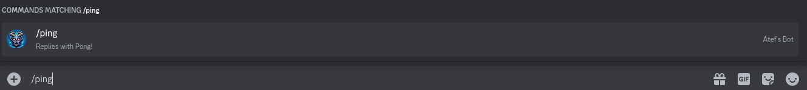

## Basic Discord Bot boilerplate
Send ping, replies with pong


```
make build 
npm i
make deployCommands
make run
```

```
open http://localhost:3000
open discord UI and authenticate your bot https://discord.com/developers/docs/getting-started
```
